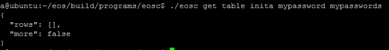
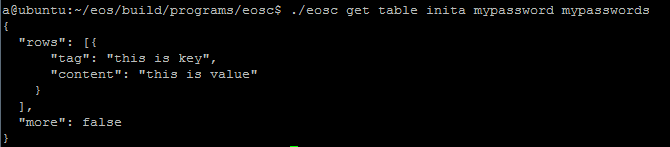

# MyPassword
基于EOS系统的键-值存储智能合约，可在用户自己账号下存储任意键-值对，目前提供`添加`，`修改`，`删除`3个接口。

计划中的接口：`备份`，`设置可备份用户`，用于将当前账号的内容备份到另一个账号。

该合约目前考虑用来做类1password软件，用户使用网页版、手机版等界面端生成随机密码，使用EOS账号的公钥加密后保存到智能合约中，只有拥有私钥才能解密保存的内容。

### 合约使用方法

* [本地环境]

根据[EOS文档](https://github.com/EOSIO/eos)搭建好环境。

使用inita账号创建名为mypassword的账号

    cd ~/eos/build/programs/eosc/
    ./eosc create key # owner_key    
    ./eosc create key # active_key
    使用上面生成的2个公钥创建mypassword账号
    ./eosc create account inita mypassword PUBLIC_KEY_1 PUBLIC_KEY_2
    导入active_key的私钥
    ./eosc wallet import XXXXXXXXXXXXXXXXXXXXXXXXXXXXXXXXXXXXXXXXXXXXXXXXXXX

发布智能合约到链上

    ./eosc set contract mypassword ../../contracts/MyPassword/mypassword.wast ../../contracts/MyPassword/mypassword.abi

查看inita账号在合约上存储的内容，可以看到内容是空的

    ./eosc get table inita mypassword mypasswords

向合约发送消息存入键-值对

    ./eosc push message mypassword addpassword '{"tag":"this is key","content":"this is value","owner":"inita"}' --scope inita --permission inita@active

再次查看inita账号在合约上存储的内容，内容已经存入

    ./eosc get table inita mypassword mypasswords

调用更改和删除接口

    ./eosc push message mypassword resetpassword '{"tag":"this is key","content":"this is value by modify","owner":"inita"}' --scope inita --permission inita@active
    ./eosc push message mypassword delpassword '{"tag":"this is key","owner":"inita"}' --scope inita --permission inita@active
